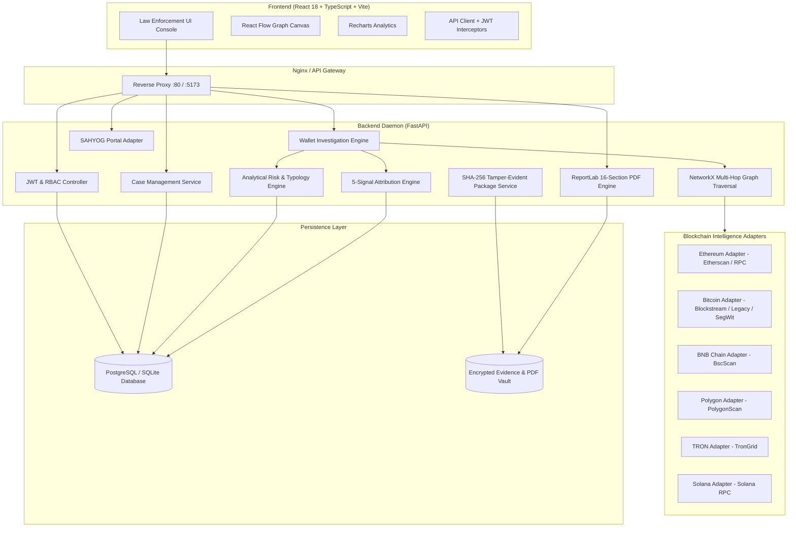

# TraceVASP — System Architecture Document

## 1. System Overview

TraceVASP is structured as a decoupled micro-architecture combining a responsive React/TypeScript client with an asynchronous FastAPI intelligence daemon and high-performance graph processing engine.

## 2. Multi-Hop Attribution Algorithm

The VASP Attribution Engine employs a 5-signal weighted heuristic model:

$$\text{Confidence} = w_1 S_{\text{cluster}} + w_2 S_{\text{interaction}} + w_3 S_{\text{hop}} + w_4 S_{\text{volume}} + w_5 S_{\text{temporal}}$$

Where:
- $w_1 = 30\%$: Address cluster match (Direct deposit wallet vs hot wallet pool).
- $w_2 = 25\%$: Interaction strength (Corroborating edge frequency).
- $w_3 = 20\%$: Hop distance proximity (Inversely proportional to traversal depth).
- $w_4 = 15\%$: Volume parity ratio ($V_{\text{dest}} / V_{\text{target}}$).
- $w_5 = 10\%$: Temporal velocity (Execution window tightness).

## 3. Cryptographic Chain-of-Custody (Section 65B Compliance)

Every analyzed artifact generates a canonical JSON serialization:
$$\text{Digest} = \text{SHA256}(\text{CanonicalJSON}(\text{Payload}))$$

Digital Evidence Packages export all intermediate states alongside a signed `manifest.json` containing SHA-256 digests for verifiable evidentiary integrity.
